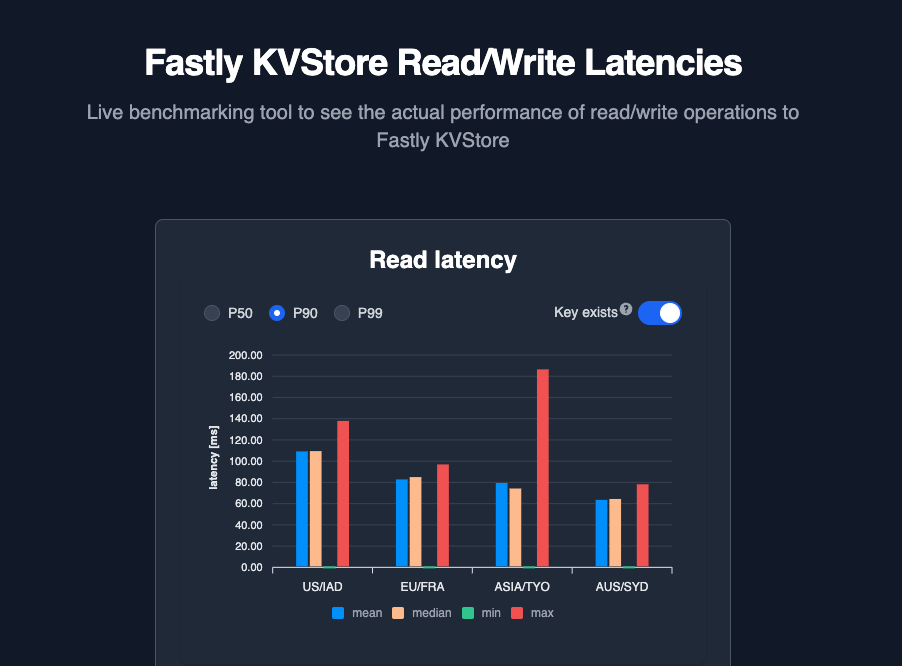
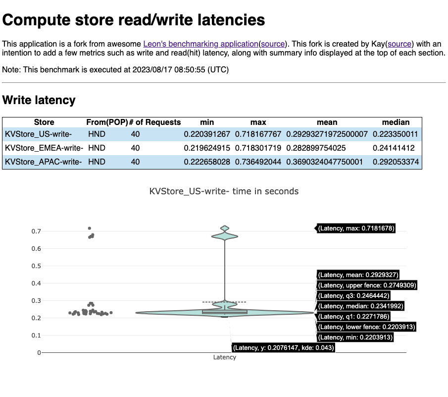

# kvstore-benchmarks

This Fastly Compute application makes dozens or a handred of requests from Fastly POP to a local Secret Store, a local Config Store and a KV Store in {US, EU, ASIA, AUS} region, to monitor read and write latencies.

There are two versions available for this tool. The first one (https://fastly-kvstore-benchmarks.edgecompute.app/) is designed and implemented to measure KVStore performance using multiple POP locations, which was first presented at Fastly's developer event on June 2024.



The second one, on the other hand, is capable of measuring benchmark scores of every Fastly's data store (ConfigStore, SecretStore, and KVStore) but from a single POP nearby your location. The source code of this version can be found in this repository. Please see `src/main.rs` for more detail if you happen to be interested in either learning how these benchmark scores are measured or running your own test.



Please feel free to reach out to Kay (sawada@fastly.com), if there is any question.

## Note

To set up default state of each Store, following snippet might be helpful;

```
for i in {1..100} ; do
  echo DEFAULT_VALUE_${i} | fastly config-store-entry create -k DEFAULT_KEY_${i} --store-id F6sHx8qNRZKdb62Yd0fiq3 --token $TOKEN --stdin
  echo DEFAULT_VALUE_${i} | fastly secret-store-entry create -n DEFAULT_KEY_${i} --store-id XJKQ1emEhYhFPASzyXi8Fo --token $TOKEN --stdin
  for kvstore_id in ep0fyq57joklquksbs7ovw 27l6qechl1te3z2a07nueb wiwe1eg573p0goxwq8a3d6 q7pjeg7v96zffk1r6fbzct; do
    fastly kv-store-entry create -k DEFAULT_KEY_${i} --store-id ${kvstore_id} --token $TOKEN --value DEFAULT_VALUE_${i}
  done
done
```